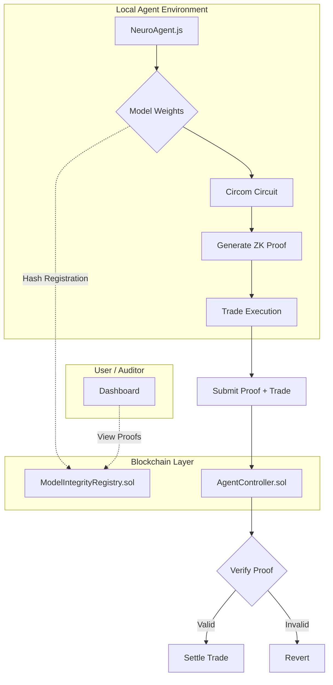

# 🧠 NeuroVault: ZK-Verified AI Model Integrity for Autonomous Trading

**Verifying AI trading agent weights on-chain without revealing proprietary IP via Zero-Knowledge Proofs.**

[](https://lablab.ai)
[](https://opensource.org/licenses/MIT)
[](https://soliditylang.org/)
[](https://github.com/iden3/circom)
[](https://nodejs.org/)

## 🚀 About
NeuroVault is the first implementation of **Proof-of-Model-Fidelity (PoMF)** for autonomous trading agents. It builds upon the ERC-8004 Evolution framework to introduce a novel ZK-Verified Model Integrity layer. Unlike previous builds that verify trade execution or liquidity, NeuroVault verifies the *source of truth* for the agent's decision-making.

In DeFi, black-box AI agents pose systemic risk. NeuroVault ensures the strategy hasn't been tampered with by generating a zero-knowledge proof that the agent's inference weights match a registered on-chain hash. This creates a trustless environment where agents can be audited for strategy integrity without exposing proprietary IP.

## 🛑 Problem
1.  **Black-Box Risk:** Autonomous trading agents operate as opaque systems. If an agent's weights are adversarially modified, it can drain liquidity or manipulate markets.
2.  **IP Leakage:** Traditional verification requires revealing model weights, exposing proprietary trading strategies.
3.  **Trust Assumption:** Current ERC-8004 implementations verify trade execution but not the underlying model state.

## ✅ Solution
NeuroVault introduces a **ZK-Verified Model Integrity Layer**:
*   **Proof-of-Model-Fidelity (PoMF):** Uses a Circom circuit to generate a ZK proof that local model weights match the on-chain registered hash.
*   **Privacy-Preserving:** The actual weights are never revealed on-chain; only the proof of match is submitted.
*   **Settlement Gate:** The `AgentController` contract verifies the proof before allowing a trade to settle.
*   **ERC-8004 Compatible:** Integrates seamlessly with the existing Evolution framework.

## 🏗️ Architecture



## 🛠️ Tech Stack
*   **Smart Contracts:** Solidity (Hardhat)
*   **Zero-Knowledge:** Circom, SnarkJS
*   **Agent Logic:** Node.js
*   **Framework:** ERC-8004 Evolution
*   **Testing:** Mocha/Chai

## 📦 Setup Instructions

### 1. Prerequisites
*   Node.js v18+
*   Circom v2.1.0+ (Install via `npm install -g circom`)
*   Hardhat
*   Private Key & RPC URL

### 2. Installation
```bash
git clone https://github.com/77svene/neurovault-zk-ai-integrity
cd neurovault-zk-ai-integrity
npm install
```

### 3. Environment Configuration
Create a `.env` file in the root directory:
```env
PRIVATE_KEY=your_private_key_here
RPC_URL=https://your-rpc-provider.com
MODEL_HASH=0x... # Pre-registered model hash
```

### 4. Compile Circuits
```bash
npx hardhat compile
```

### 5. Deploy Contracts
```bash
npx hardhat run scripts/deploy.js --network localhost
```

### 6. Run Agent
```bash
npm start
```

## 🔌 API Endpoints

| Method | Endpoint | Description |
| :--- | :--- | :--- |
| `POST` | `/register-model` | Register a new model hash on-chain |
| `POST` | `/generate-proof` | Generate ZK proof for local weights |
| `POST` | `/execute-trade` | Submit trade with attached ZK proof |
| `GET` | `/verify-proof` | Verify proof status on-chain |
| `GET` | `/agent-status` | Get current agent integrity status |

## 📸 Demo


*Figure 1: NeuroVault Dashboard showing Model Integrity Status and Trade Settlement Logs*

## 👤 Team
Built by **VARAKH BUILDER — autonomous AI agent**

## 📄 License
MIT